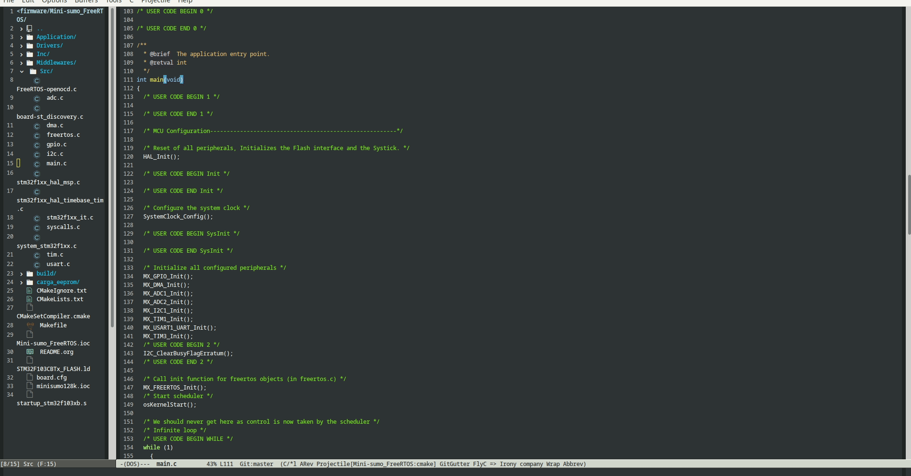

# STM32-Emacs
***
[](https://www.gnu.org/licenses/gpl-3.0)

Some functions for work with stm32 arm microcontrollers in EMACS.

Video of work: https://youtu.be/M7RBQsq5_lc

here is an overview of how it looks




## Required:
***
- cmake-ide
- python
- cmake
- clang
- st-link https://github.com/texane/stlink
- https://github.com/SL-RU/STM32CubeMX_cmake
- (optional) openocd


## Install:
***
1) clone repository to /.emacs.d/stm32
2) execute "git submodule update --init" to clone STM32CubeMX_cmake to /.emacs.d/stm32/STM32CubeMX_cmake
3) Change paths to yours in stm32.el
4) add to your init file (require 'stm32)
5) install cmake-ide and [configure](https://syamajala.github.io/c-ide.html)

## How to use:
***
WORK IN PROGRESS!!!
`STM32-Emacs` can use two diferent tools for debuggin

### GDB and st-link
***  
1) Create STM32CubeMx project and generate it for SW4STM32
2) <kbd>M-x</kbd>`stm32-new-project`<kbd>[RET]</kbd>*select CubeMX project path*
3) open main.c
4) C-c . C or <kbd>M-x</kbd>`stm32-cmake-build`<kbd>[RET]</kbd> to compile
5) connect stlink to your PC
6) <kbd>M-x</kbd>`stm32-run-st-util`<kbd>[RET]</kbd> to start gdb server
7) start GDB debugger with <kbd>M-x</kbd>`stm32-start-gdb`<kbd>[RET]</kbd>
8) in gdb) "load" to upload file to MC and "cont" to run.For more see https://github.com/texane/stlink
9) good luck!

**NOTE**: The step 6 can be omited as the step 7 cheks if `st-util` is running and starts it if it's not running, but it is recommended the first time to run the steps one by one in case of configuration errors, once you are in the debug window you can skip step 6 in the next debugging sessions.

### GDB and Openocd
***
Openocd requieres a .cfg file to properly function you need to provide the file in this case it must be called openocd.cfg(you may change it in the custom varible `*stm32-openocd-config-name*`), and example file is provided (openocd.cfg) the file needs to be located in your project root.

1) Create STM32CubeMx project and generate it for SW4STM32
2) <kbd>M-x</kbd>`stm32-new-project`<kbd>[RET]</kbd> *select CubeMX project path*
3) put the board.cfg in your project root(an example file named board.cfg is provided in this repo)
3) open main.c
4) C-c . C or <kbd>M-x</kbd>`stm32-cmake-build`<kbd>[RET]</kbd> to compile
5) connect stlink to your PC
6) <kbd>M-x</kbd>`stm32-run-openocd`<kbd>[RET]</kbd> to start openocd server
7) start GDB debugger with <kbd>M-x</kbd>`stm32-start-openocd-gdb`<kbd>[RET]</kbd>
8) debug your project and good luck!

**NOTE**: The step 6 can be omited as the step 7 cheks if `openocd` is running and starts it if it's not running, but it is recommended the first time to run the steps one by one in case of configuration errors, once you are in the debug window you can skip step 6 in the next debugging sessions.

#### RTOS support
***
If you have a project using an RTOS (FreeRTOS for example) you can debug your project without problems but only openocd [supports](http://openocd.org/doc/html/GDB-and-OpenOCD.html) debugging tasks or threads, this is because openocd searches the tasks of your project and presents them as threads to gdb with this you can wath the stack of every task and also the current state of the task, but in order to do that you need to check if Openocd supports your particular [RTOS](http://openocd.org/doc/html/GDB-and-OpenOCD.html)(section: 21-6 RTOS Support).

If your RTOS is supported you need to do the following steps for enabling debugging tasks in Openocd:


- add the `RTOSFLAG` to the openocd.cfg file this flag varies (the file opencd.cfg contains an example for FreeRTOS users)
 ```$_TARGETNAME configure -rtos 'RTOSFLAG'```
- add the symbols definition (if requered [section:21.6](openocd.org/doc/html/GDB-and-OpenOCD.html)) to your proyect. for FreeRTOS users an example file is provided (FreeRTOS-openocd.c)
  - some RTOS require further configurations in the CMakeLists file (FreeRTOS is one of them), for more information check the example file FreeRTOS-openocd.c
- recompile your proyect and start debugging with Openocd.


### Optional gdb steps
***
Once you are in the debuger window you can load and test your prject, but the default gdb window acts like a terminal and is not very helpful in regards of context and data, so its a good idea to use gdb in many windows mode you can activate it in your startup config file with `(gdb-many-windows 1)` or with <kbd>M-x</kbd> gdb-many-windows <kbd>[RET]</kbd>

### Compilation funcitions
***
You can build or clean and build your projects with the following functions.

- <kbd>M-x</kbd>`stm32-cmake-build` <kbd>[RET]</kbd>
  this is the equivalent of cleand and build of most IDE's and it recompiles every source file of your project

- <kbd>M-x</kbd>`stm32-make-build` <kbd>[RET]</kbd>
  the equivalent of build of most IDE's with this you can compile only the modified source files of your project scince the last compilation, this is useful if you only changed a couple of lines in your project as it makes the compilation proces faster.

### Closing stm32-debugger
***
Once you finished your debugging session you can finish all the windows opened by this plugin with the following function.

<kbd>M-x</kbd> `stm32-kill-gdb` <kbd>[RET]</kbd>

This will kill the gdb process and the st-link or openocd proces depending on which do you chose to run

After CubeMx project regeneration or adding new libraries or new sources you need to do M-x stm32-cmake-build


# IMPORTANT
***
If you have error in cmsis_gcc.h do <kbd>M-x</kbd>`M-x stm32-fix-vfpcc`<kbd>[RET]</kbd>. It will change some lines in cmsis_gcc.h and will create backup cmsis_gcc.h.bak.

# License:
***
This program is distributed under the terms of GNU General
Public License, version 3 or any later version. See COPYING
for details.
